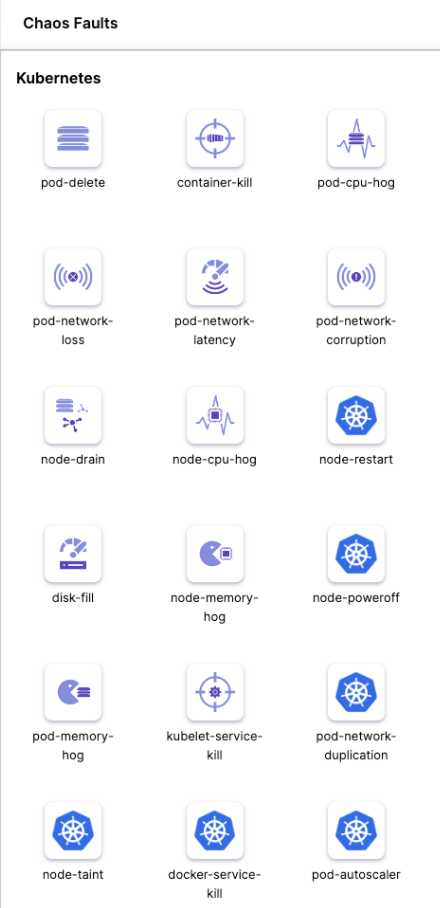

# Litmus Chaos & OpenTelemetry Demo

**Authors: Adam Biśta, Gracjan Filipek, Jakub Gawron, Krzysztof Usnarski**

2025, group 20

## 1. Introduction

This document shows how to use Litmus Chaos and OpenTelemetry to test how well a Kubernetes-based application can handle failures. We use Sock Shop — a free, open-source demo app built to mimic a real online store — because it's perfect for testing microservices and DevOps tools like monitoring, tracing, and chaos engineering.

## 2. Theoretical foundations

| Layer | Technology | Purpose |
| --- | --- | --- |
| Chaos | Litmus Chaos | Inject pod‑level & network faults via CRDs (Custom Resource Definition) |
| Observability | Prometheus Grafana | Collect traces, scrape metrics, display dashboards |
| Platform | Kubernetes, Helm | Cluster, package manager |
| Application | Sock Shop | Workload under test |
| Infrastructure as Code | Helm charts, Kustomize | Declarative deployment |

LitmusChaos is a Cloud-Native Chaos Engineering Framework with cross-cloud support. It is a CNCF Incubating project with adoption across several organizations. Its mission is to help Kubernetes SREs and Developers to find weaknesses in both Non-Kubernetes as well as platforms and applications running on Kubernetes by providing a complete Chaos Engineering framework and associated Chaos Experiments.

Litmus can be used to run chaos experiments initially in the staging environment and eventually in production to find bugs and vulnerabilities, fixing which leads to an increased resilience of the system. Litmus adopts a "Kubernetes-native" approach to define chaos intent in a declarative manner via Kubernetes custom resources (CRs).

### Importance of resilience
As Litmus documentation says: 'Keep verifying is the key. Robust testing before upgrades is not good enough, mainly because you cannot possibly consider all sorts of faults during upgrade testing. This introduces the concept of Chaos Engineering. The process of "continuously verifying if your service is resilient against faults" is called Chaos Engineering'.

**Key chaos terms**:

- **Steady‑state**: the normal, measurable behaviour of the system (e.g. request rate, latency, error rate) under healthy conditions.

- **Hypothesis**: the assumption that the system will continue to behave normally despite injected faults.

- **Chaos Experiments**: they are fundamental units within the LitmusChaos architecture. Users can choose between readily available chaos experiments or create new ones to construct a required Chaos Scenario.

- **Chaos Scenario**: more than a simple chaos experiment. It supports the user in defining the expected result, observing the result, analysing the overall system behaviour, and in the decision-making process if the system needs to be tuned for improving the resilience.

- **Chaos Engineering**: the process of "continuously verifying if your service is resilient against faults".

- **Fault**. A type of disruption in the application. Examples of faults:

- **Blast radius**: the scope or impact zone of the experiment (e.g. one pod, one service, or full namespace).

- **Abort criteria**: predefined conditions that will stop the experiment if the system becomes unstable (e.g. 5xx errors > 5%).

## 3. Case study concept description

Hypothesis: Sock Shop sustains p95 latency < 500 ms and HTTP 5xx ≤ 1 % while facing:

1. Random pod deletion (***pod-delete***).

2. 200 ms inter‑service network latency (***network-latency***).

The experiment workflow:

1. Establish steady‑state via load generator (50 RPS - Requests Per Second).

2. Inject the fault with Litmus CRDs.

3. Observe real‑time traces & metrics in Grafana.

4. Compare KPIs (Key Performance Indicator - A measurable value that shows how well a system is performing, e.g p95 **latency < 500 ms** or  **HTTP 5xx < 1%** )  against the hypothesis and produce a verdict (Pass / Fail).

## 4. Solution architecture

## 5. Environment configuration description

## 6. Installation method

## 7. How to reproduce - step by step

### 1. Infrastructure as Code approach

## 8. Demo deployment steps:

### 1. Configuration set-up

### 2. Data preparation

### 3. Execution procedure

### 4. Results presentation

## 9. Using AI in the project

## 10. Summary – conclusions

## 11. References
