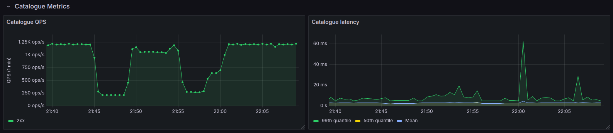

# Litmus Chaos & OpenTelemetry Demo

**Authors: Adam Biśta, Gracjan Filipek, Jakub Gawron, Krzysztof Usnarski**

2025, group 20

## 1. Introduction

This document shows how to use Litmus Chaos and OpenTelemetry to test how well a Kubernetes-based application can handle failures. We use Sock Shop — a free, open-source demo app built to mimic a real online store — because it's perfect for testing microservices and DevOps tools like monitoring, tracing, and chaos engineering.

## 2. Theoretical foundations

| Layer | Technology | Purpose |
| --- | --- | --- |
| Chaos | Litmus Chaos | Inject pod‑level & network faults via CRDs (Custom Resource Definition) |
| Metrics backend | Prometheus | Collect traces, scrape metrics |
| Metrics visualization | Grafana | Display dashboards |
| Platform | Kubernetes | Cluster |
| Application | Sock Shop | Workload under test |
| Infrastructure as Code | YAML files | Declarative deployment |

LitmusChaos is a Cloud-Native Chaos Engineering Framework with cross-cloud support. It is a CNCF Incubating project with adoption across several organizations. Its mission is to help Kubernetes SREs and Developers to find weaknesses in both Non-Kubernetes as well as platforms and applications running on Kubernetes by providing a complete Chaos Engineering framework and associated Chaos Experiments.

Litmus can be used to run chaos experiments initially in the staging environment and eventually in production to find bugs and vulnerabilities, fixing which leads to an increased resilience of the system. Litmus adopts a "Kubernetes-native" approach to define chaos intent in a declarative manner via Kubernetes custom resources (CRs).

### Importance of resilience
As Litmus documentation says: 'Keep verifying is the key. Robust testing before upgrades is not good enough, mainly because you cannot possibly consider all sorts of faults during upgrade testing. This introduces the concept of Chaos Engineering. The process of "continuously verifying if your service is resilient against faults" is called Chaos Engineering'.

**Key chaos terms**:

- **Steady‑state**: the normal, measurable behaviour of the system (e.g. request rate, latency, error rate) under healthy conditions.

- **Hypothesis**: the assumption that the system will continue to behave normally despite injected faults.

- **Chaos Experiments**: they are fundamental units within the LitmusChaos architecture. Users can choose between readily available chaos experiments or create new ones to construct a required Chaos Scenario.

- **Chaos Scenario**: more than a simple chaos experiment. It supports the user in defining the expected result, observing the result, analysing the overall system behaviour, and in the decision-making process if the system needs to be tuned for improving the resilience.

- **Chaos Engineering**: the process of "continuously verifying if your service is resilient against faults".

- **Fault**. A type of disruption in the application. Examples of faults:


- **Blast radius**: the scope or impact zone of the experiment (e.g. one pod, one service, or full namespace).

- **Abort criteria**: predefined conditions that will stop the experiment if the system becomes unstable (e.g. 5xx errors > 5%).

## 3. Case study concept description

Hypothesis: Sock Shop sustains p95 latency < 500 ms and HTTP 5xx ≤ 1 % while facing:

1. Random pod deletion (***pod-delete***).

2. 200 ms inter‑service network latency (***network-latency***).

The experiment workflow:

1. Establish steady‑state via load generator (50 RPS - Requests Per Second).

2. Inject the fault with Litmus CRDs.

3. Observe real‑time traces & metrics in Grafana.

4. Compare KPIs (Key Performance Indicator - A measurable value that shows how well a system is performing, e.g p95 **latency < 500 ms** or  **HTTP 5xx < 1%** )  against the hypothesis and produce a verdict (Pass / Fail).

**Experiment:**
Introducing 200 ms inter-service network latency to existing microservices cluster. 


## 4. Solution architecture

The application will be run on Amazon Web Service leveraging the Elastic Kubernetes Service. The business application, as mentioned in the previous section 1., will be the [SockShop](https://github.com/ocp-power-demos/sock-shop-demo), used widely as a demo application because of its microservice-centered structure. 

SockShop architecture schema:


Sock shop exporter will be scrapped for the ongoing communication statistics by the metrics collecting backend - [Prometheus](https://prometheus.io/).

In order to visualize the collected metrics and to observe changes that we expect when introducing the faults with [Litmus](https://litmuschaos.io/), we use [Grafana](https://grafana.com/) and set it up to work correctly with [Prometheus](https://prometheus.io/).

In the cluster there are three defined namespaces: `monitoring`,  `sock-shop` and `litmus`.

<!-- TODO: insert the whole cluster architecture diagram (with namespaces, litmus pods, experiments, engines, prometheus and grafana) -->


1. **Application --> Prometheus**
   The Sock Shop application exposes metrics, which are scraped by Prometheus in the `monitoring` namespace.

2. **Prometheus --> Grafana**
   Grafana retrieves time series data from Prometheus to visualize system behavior and experiment outcomes.

3. **Litmus Operator --> Chaos Runner**
   The Litmus Operator manages and triggers the Chaos Runner based on defined `ChaosEngine` resources.

4. **Chaos Runner --> Application**
   The Chaos Runner injects faults into the application, such as deleting pods, to test its resilience.

5. **Chaos Runner --> ChaosResult**
   After executing an experiment, the Chaos Runner writes the outcome (e.g., verdict, duration) into a `ChaosResult` custom resource.

6. **Chaos Exporter --> ChaosResult**
   The Chaos Exporter reads experiment results from `ChaosResult` using the Kubernetes API.

7. **Chaos Exporter --> Prometheus**
   The Chaos Exporter exposes those results as Prometheus metrics, which are scraped for analysis and visualization.


## 5. Environment configuration description

Amazon Elastic Kubernetes Service - configuration of the cluster:


Node group configuration:


## 6. Installation method

In order to install the application on the Kubernetes cluster, one must first establish a connection with the AWS EKS cluster.

Verify the connection setup:
```bash
aws eks --region us-east-1 update-kubeconfig --name <cluster_name>
```

## 7. How to reproduce - step by step. Infrastructure as Code approach

All the necessary source code is in the `deploy/` directory in this repository.

Create sock shop namespace:
```bash
kubectl apply -f deploy/sock-shop/01-namespace.yaml
```

Install Litmus infrastructure components:
```bash
kubectl apply -f https://litmuschaos.github.io/litmus/litmus-operator-v3.0.0.yaml
```
```bash
kubectl apply -f https://litmuschaos.github.io/litmus/litmus-admin-rbac.yaml
```

Add monitoring (Prometheus + Grafana + Chaos Exporter):
```bash
kubectl apply -f deploy/litmus-metrics/chaos-exporter.yaml;
kubectl apply -f deploy/monitoring/01-monitoring-ns.yaml;
kubectl apply -f deploy/monitoring/02-prometheus-rbac.yaml;
kubectl apply -f deploy/monitoring/03-prometheus-configmap.yaml;
kubectl apply -f deploy/monitoring/04-prometheus-alert-rules.yaml;
kubectl apply -f deploy/monitoring/05-prometheus-deployment.yaml;
kubectl apply -f deploy/monitoring/06-prometheus-svc.yaml;
kubectl apply -f deploy/monitoring/07-grafana-deployment.yaml;
kubectl apply -f deploy/monitoring/08-grafana-svc.yaml
```

Deploy sock shop:
```bash
kubectl apply -f deploy/sock-shop/
```
```bash
watch -n 5 kubectl get pods -n sock-shop
```

Get the Prometheus cluster IP address:
```bash
kubectl get svc -n monitoring
```

Set up Grafana:
```bash
kubectl port-forward service/grafana 3000:3000 --namespace=monitoring
```
Log into Grafana (default credentials: username: admin, password: admin) and create a new datasource, inputing Prometheus address and naming it "DS_PROMETHEUS".

Create new dashboard. `Dashboard` --> `New` --> `Import` --> `Copy` [this dashboard](./deploy/monitoring/12-grafana-dashboard_complete.json).

## 8. Demo deployment steps:

### 1. Configuration set-up

The neccessary environment setup steps has been descibed in sections [Environment configuration description](#5-environment-configuration-description) and [Installation method](#6-installation-method).

Cluster components setup has been described in section [How to reproduce - step-by-step](#7-how-to-reproduce---step-by-step-infrastructure-as-code-approach).

### 2. Data preparation

Download and install Litmus experiments ([chaos experiments](https://github.com/litmuschaos/chaos-charts/tree/master)):
```bash
tar -zxvf <(curl -sL https://github.com/litmuschaos/chaos-charts/archive/3.0.0.tar.gz)
```
```bash
find chaos-charts-3.0.0 -name experiments.yaml | grep kubernetes | xargs kubectl apply -n litmus -f
```

### 3. Execution procedure

Choose an experiment from the [experiments](./experiments/) directory and run it:
```bash
kubectl apply -f experiments/<chosen-experiment>.yaml
```

Below are descriptions and visualizations of the three prepared experiments:

### pod-delete
Deletes pods of an application to test self-healing and availability mechanisms.  
[Documentation](https://litmuschaos.github.io/litmus/experiments/categories/pods/pod-delete/)  


### pod-network-latency
Injects network latency into a container to simulate poor network conditions and test application behavior.  
[Documentation](https://litmuschaos.github.io/litmus/experiments/categories/pods/pod-network-latency/)  


### pod-cpu-hog 
Simulates high CPU usage on a specific container to test how the application handles resource stress.  
[Documentation](https://litmuschaos.github.io/litmus/experiments/categories/pods/pod-cpu-hog/)  


Verify the experiment 
```bash
 kubectl describe chaosengine catalogue-experiments -n litmus
```

In case of an error, check the logs:
```bash
kubectl logs <pod-name> -n litmus
```


### 4. Results presentation

The Litmus Chaos experiments were successfully executed and monitored using Grafana dashboards. Three different types of faults were injected: `pod-cpu-hog`, `pod-delete`, and `pod-network-latency`. All chaos experiments completed successfully without failures.

**Chaos Experiments Injection**:
  Each of the three experiments was triggered and shown in the "Chaos Experiments" panel with one injection per fault type.


<!-- 
 -->

#### Carts experiment (pod-network-latency) description


```yaml
❯ kubectl describe chaosengine carts-experiments -n litmus
Name:         carts-experiments
Namespace:    litmus
Labels:       <none>
Annotations:  <none>
API Version:  litmuschaos.io/v1alpha1
Kind:         ChaosEngine
Metadata:
  Creation Timestamp:  2025-06-02T19:11:40Z
  Finalizers:
    chaosengine.litmuschaos.io/finalizer
  Generation:        65
  Resource Version:  35179
  UID:               6c5128b2-b993-477f-876a-699cfcb2518b
Spec:
  Appinfo:
    Appkind:              deployment
    Applabel:             name=carts
    Appns:                sock-shop
  Chaos Service Account:  litmus-admin
  Components:
    Runner:
      Resources:
  Engine State:  stop
  Experiments:
    Name:  pod-network-latency
    Spec:
      Components:
        Env:
          Name:   APP_NAMESPACE
          Value:  sock-shop
          Name:   APP_LABEL
          Value:  name=carts
          Name:   APP_KIND
          Value:  deployment
          Name:   TARGET_CONTAINER
          Value:  carts
          Name:   NETWORK_INTERFACE
          Value:  eth0
          Name:   NETWORK_LATENCY
          Value:  200
          Name:   TOTAL_CHAOS_DURATION
          Value:  240
          Name:   PODS_AFFECTED_PERC
          Value:  100
          Name:   CONTAINER_RUNTIME
          Value:  containerd
          Name:   SOCKET_PATH
          Value:  /run/containerd/containerd.sock
        Resources:
        Status Check Timeouts:
Status:
  Engine Status:  completed
  Experiments:
    Experiment Pod:    pod-network-latency-e6mctx-5rfvv
    Last Update Time:  2025-06-02T19:49:00Z
    Name:              pod-network-latency
    Runner:            carts-experiments-runner
    Status:            Completed
    Verdict:           Pass
Events:
  Type    Reason                     Age                  From                              Message
  ----    ------                     ----                 ----                              -------
  Normal  ChaosEngineInitialized     5m33s (x2 over 38m)  chaos-operator                    Identifying app under test & launching carts-experiments-runner
  Normal  ExperimentDependencyCheck  5m29s (x2 over 38m)  carts-experiments-runner          Experiment resources validated for Chaos Experiment: pod-network-latency
  Normal  ExperimentJobCreate        5m29s (x2 over 38m)  carts-experiments-runner          Experiment Job pod-network-latency-e6mctx for Chaos Experiment: pod-network-latency
  Normal  PreChaosCheck              5m22s (x2 over 38m)  pod-network-latency-e6mctx-5rfvv  Skipped the default checks
  Normal  ChaosInject                5m21s (x2 over 38m)  pod-network-latency-helper-b89xx  Injected pod-network-latency chaos on application pods
  Normal  PostChaosCheck             77s (x2 over 37m)    pod-network-latency-e6mctx-5rfvv  Skipped the default checks
  Normal  Summary                    73s (x2 over 37m)    pod-network-latency-e6mctx-5rfvv  pod-network-latency experiment has been Passed
  Normal  ExperimentJobCleanUp       67s (x2 over 36m)    carts-experiments-runner          Experiment Job pod-network-latency-e6mctx will be retained
  Normal  ChaosEngineCompleted       66s (x2 over 36m)    chaos-operator                    ChaosEngine completed, will delete or retain the resources according to jobCleanUpPolicy

```

#### Catalogue experiment (pod-cpu-hog) description



```yaml
❯ kubectl describe chaosengine catalogue-experiments -n litmus
Name:         catalogue-experiments
Namespace:    litmus
Labels:       <none>
Annotations:  <none>
API Version:  litmuschaos.io/v1alpha1
Kind:         ChaosEngine
Metadata:
  Creation Timestamp:  2025-06-02T19:09:22Z
  Finalizers:
    chaosengine.litmuschaos.io/finalizer
  Generation:        95
  Resource Version:  36438
  UID:               4554d61e-9ef3-4b21-a538-c634e0c829dd
Spec:
  Appinfo:
    Appkind:              deployment
    Applabel:             name=catalogue
    Appns:                sock-shop
  Chaos Service Account:  litmus-admin
  Components:
    Runner:
      Resources:
  Engine State:  stop
  Experiments:
    Name:  pod-cpu-hog
    Spec:
      Components:
        Env:
          Name:   APP_NAMESPACE
          Value:  sock-shop
          Name:   APP_LABEL
          Value:  name=catalogue
          Name:   APP_KIND
          Value:  deployment
          Name:   PODS_AFFECTED_PERC
          Value:  100
          Name:   TARGET_CONTAINER
          Value:  catalogue
          Name:   CPU_CORES
          Value:  2
          Name:   TOTAL_CHAOS_DURATION
          Value:  240
        Resources:
        Status Check Timeouts:
Status:
  Engine Status:  completed
  Experiments:
    Experiment Pod:    pod-cpu-hog-znscki-g4wj7
    Last Update Time:  2025-06-02T19:53:53Z
    Name:              pod-cpu-hog
    Runner:            catalogue-experiments-runner
    Status:            Completed
    Verdict:           Pass
Events:
  Type    Reason                     Age                  From                          Message
  ----    ------                     ----                 ----                          -------
  Normal  ChaosEngineInitialized     5m21s (x2 over 45m)  chaos-operator                Identifying app under test & launching catalogue-experiments-runner
  Normal  ExperimentDependencyCheck  5m20s (x2 over 45m)  catalogue-experiments-runner  Experiment resources validated for Chaos Experiment: pod-cpu-hog
  Normal  ExperimentJobCreate        5m20s (x2 over 45m)  catalogue-experiments-runner  Experiment Job pod-cpu-hog-znscki for Chaos Experiment: pod-cpu-hog
  Normal  PreChaosCheck              5m13s (x2 over 45m)  pod-cpu-hog-znscki-g4wj7      Skipped the default checks
  Normal  ChaosInject                5m11s (x2 over 45m)  pod-cpu-hog-helper-4t2t2      Injecting pod-cpu-hog chaos on application pod
  Normal  PostChaosCheck             67s (x2 over 41m)    pod-cpu-hog-znscki-g4wj7      Skipped the default checks
  Normal  Summary                    63s (x2 over 41m)    pod-cpu-hog-znscki-g4wj7      pod-cpu-hog experiment has been Passed
  Normal  ExperimentJobCleanUp       57s (x2 over 41m)    catalogue-experiments-runner  Experiment Job pod-cpu-hog-znscki will be retained
  Normal  ChaosEngineCompleted       57s (x2 over 41m)    chaos-operator                ChaosEngine completed, will delete or retain the resources according to jobCleanUpPolicy

```

#### Orders experiment (pod-delete) description


```yaml
❯ kubectl describe chaosengine orders-experiments -n litmus
Name:         orders-experiments
Namespace:    litmus
Labels:       <none>
Annotations:  <none>
API Version:  litmuschaos.io/v1alpha1
Kind:         ChaosEngine
Metadata:
  Creation Timestamp:  2025-06-02T19:13:06Z
  Finalizers:
    chaosengine.litmuschaos.io/finalizer
  Generation:        77
  Resource Version:  37572
  UID:               db4e5a90-1485-4760-998f-4eddeecd588d
Spec:
  Appinfo:
    Appkind:              deployment
    Applabel:             name=orders
    Appns:                sock-shop
  Chaos Service Account:  litmus-admin
  Components:
    Runner:
      Resources:
  Engine State:  stop
  Experiments:
    Name:  pod-delete
    Spec:
      Components:
        Env:
          Name:   APP_NAMESPACE
          Value:  sock-shop
          Name:   APP_LABEL
          Value:  name=orders
          Name:   APP_KIND
          Value:  deployment
          Name:   TOTAL_CHAOS_DURATION
          Value:  60
          Name:   CHAOS_INTERVAL
          Value:  30
          Name:   PODS_AFFECTED_PERC
          Value:  100
          Name:   FORCE
          Value:  true
        Resources:
        Status Check Timeouts:
Status:
  Engine Status:  completed
  Experiments:
    Experiment Pod:    pod-delete-ghqkgj-nm48p
    Last Update Time:  2025-06-02T19:58:11Z
    Name:              pod-delete
    Runner:            orders-experiments-runner
    Status:            Completed
    Verdict:           Pass
Events:
  Type    Reason                     Age                  From                       Message
  ----    ------                     ----                 ----                       -------
  Normal  ChaosEngineInitialized     9m19s (x2 over 50m)  chaos-operator             Identifying app under test & launching orders-experiments-runner
  Normal  ExperimentDependencyCheck  9m17s (x2 over 50m)  orders-experiments-runner  Experiment resources validated for Chaos Experiment: pod-delete
  Normal  ExperimentJobCreate        9m17s (x2 over 50m)  orders-experiments-runner  Experiment Job pod-delete-ghqkgj for Chaos Experiment: pod-delete
  Normal  ChaosInject                9m10s (x2 over 50m)  pod-delete-ghqkgj-nm48p    Injecting pod-delete chaos on application pod
  Normal  PreChaosCheck              9m10s (x2 over 50m)  pod-delete-ghqkgj-nm48p    Skipped the default checks
  Normal  PostChaosCheck             6m1s (x2 over 47m)   pod-delete-ghqkgj-nm48p    Skipped the default checks
  Normal  Summary                    5m57s (x2 over 47m)  pod-delete-ghqkgj-nm48p    pod-delete experiment has been Passed
  Normal  ExperimentJobCleanUp       5m50s (x2 over 47m)  orders-experiments-runner  Experiment Job pod-delete-ghqkgj will be retained
  Normal  ChaosEngineCompleted       5m49s (x2 over 47m)  chaos-operator             ChaosEngine completed, will delete or retain the resources according to jobCleanUpPolicy

```

**System Behavior Metrics**:

* **Catalogue QPS** temporarily dropped during the `pod-delete` fault injection.
* **Catalogue Latency** briefly spiked during the `pod-network-latency` injection, with the 99th percentile reaching approximately 2 seconds.

* **Catalogue p95 Latency** temporarily increased during the `pod-network-latency` injection, peaking at **495 ms around 15:34:30**, but remained **within the hypothesis threshold (p95 < 500 ms)**.


## 9. Using AI in the project

## 10. Summary – conclusions

## 11. References
